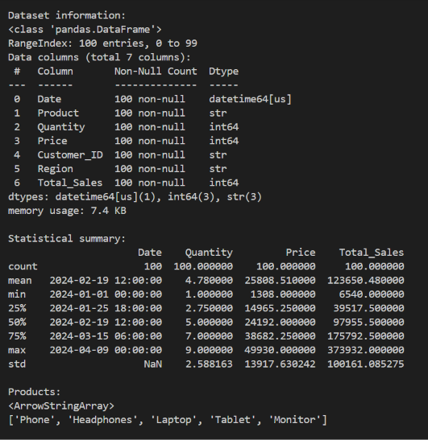
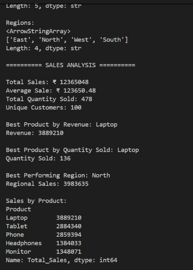
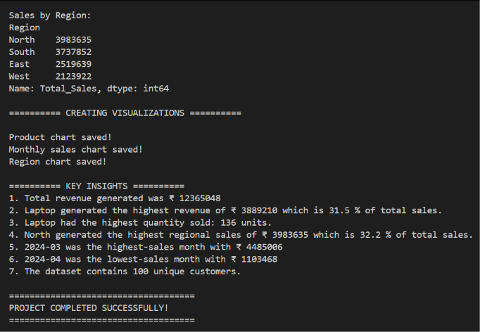
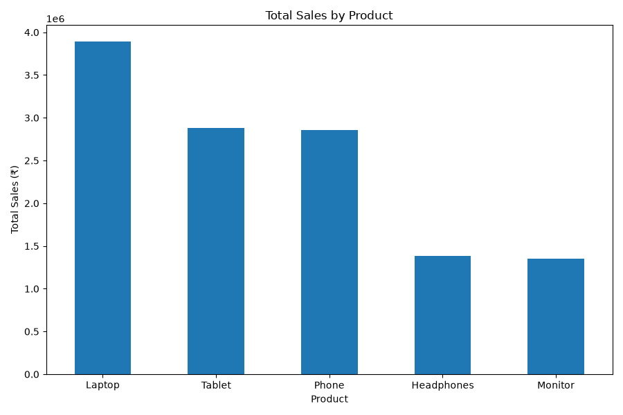
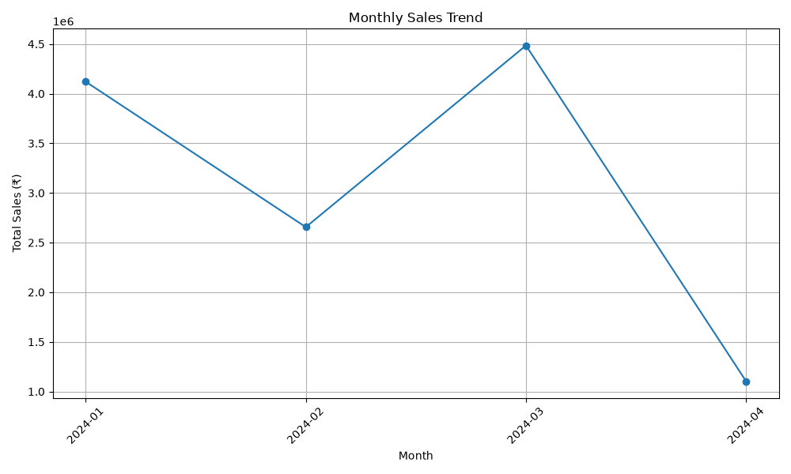
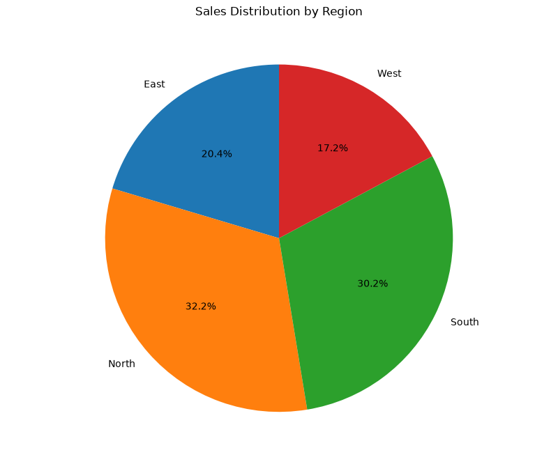

# E-Commerce Sales Data Analysis

## Project Overview

This project performs a complete data analysis of an e-commerce sales dataset using Python.

The project follows a complete data analysis pipeline:

**Load → Clean → Explore → Analyze → Visualize → Generate Insights**

The main objective is to analyze sales performance across different products, regions, and months and identify meaningful business insights from the data.

---

## Objectives

The main objectives of this project are:

* Analyze overall sales performance.
* Identify the best-performing products.
* Compare sales across different regions.
* Analyze monthly sales trends.
* Identify meaningful patterns in the dataset.
* Create clear and professional data visualizations.
* Generate useful business insights from the analysis.
* Validate and test the data-processing pipeline.

---

## Technologies Used

* **Python**
* **Pandas**
* **Matplotlib**

---

## Dataset

The dataset contains **100 e-commerce transaction records** and **7 columns**.

| Column      | Description                    |
| ----------- | ------------------------------ |
| Date        | Date of the transaction        |
| Product     | Product purchased              |
| Quantity    | Number of units purchased      |
| Price       | Price per unit                 |
| Customer_ID | Unique customer identifier     |
| Region      | Customer's region              |
| Total_Sales | Total value of the transaction |

### Products

The dataset contains five products:

* Laptop
* Tablet
* Phone
* Headphones
* Monitor

### Regions

The dataset contains four regions:

* North
* South
* East
* West

---

## Project Structure

```text
Ecommerce-sales-analysis/
│
├── data/
│   └── data.csv
│
├── visualizations/
│   ├── monthly_sales.png
│   ├── sales_by_product.png
│   └── sales_by_region.png
│
├── report/
│   ├── project_report.md
│   ├── execution_output_1.png
│   ├── execution_output_2.png
│   ├── execution_output_3.png
│   └── execution_output_4.png
│
├── .gitignore
├── README.md
├── main.py
└── requirements.txt
```

---

## Data Analysis Workflow

The project follows the following workflow:

### 1. Data Loading

The dataset is loaded from the `data/data.csv` file using Pandas.

### 2. Data Cleaning and Validation

The dataset is checked for:

* Missing values
* Duplicate records
* Invalid dates
* Invalid numerical values
* Invalid quantity values
* Invalid price values
* Invalid total sales values

The `Date` column is converted into datetime format for further analysis.

### 3. Data Exploration

The dataset is explored using:

* Dataset dimensions
* First few records
* Data types
* Statistical summary
* Available products
* Available regions

### 4. Data Analysis

The following metrics are calculated:

* Total sales revenue
* Average transaction value
* Total quantity sold
* Number of unique customers
* Sales by product
* Quantity sold by product
* Sales by region
* Monthly sales
* Best-performing product
* Best-performing region
* Highest-sales month
* Lowest-sales month

### 5. Data Visualization

Three types of visualizations are generated:

* **Bar Chart** – Product-wise sales comparison
* **Line Chart** – Monthly sales trend
* **Pie Chart** – Regional sales distribution

### 6. Insight Generation

The calculated results are interpreted to identify important sales patterns and business insights.

---

## Technical Details

### Programming Language

The project is implemented using **Python**.

### Libraries

**Pandas** is used for:

* Loading the CSV dataset
* Data cleaning
* Data validation
* Data transformation
* Grouping and aggregation
* Statistical analysis

**Matplotlib** is used for:

* Creating bar charts
* Creating line charts
* Creating pie charts
* Saving visualizations as PNG files

### Data Processing

The main processing steps are:

1. Verify that the dataset file exists.
2. Load the CSV file using Pandas.
3. Inspect the dataset structure and data types.
4. Check for missing values.
5. Check for duplicate records.
6. Convert the `Date` column to datetime format.
7. Validate numerical columns.
8. Perform product-wise, region-wise, and monthly aggregations.
9. Generate visualizations.
10. Display the final analysis results and insights.

### Analysis Methods

Pandas `groupby()` and aggregation operations are used to calculate sales by:

* Product
* Region
* Month

Maximum and minimum values are then used to identify the highest-performing product, region, and month.

### Project Architecture

The project follows a simple sequential architecture:

**CSV Dataset → Data Loading → Data Cleaning → Data Validation → Data Analysis → Visualization → Insights**

This makes the project easy to understand, execute, and reproduce.

---

## Key Results

The analysis produced the following results:

| Metric                  |      Result |
| ----------------------- | ----------: |
| Total Revenue           | ₹12,365,048 |
| Average Sale            | ₹123,650.48 |
| Total Quantity Sold     |   478 units |
| Unique Customers        |         100 |
| Best Product by Revenue |      Laptop |
| Best Product Revenue    |  ₹3,889,210 |
| Best Product Quantity   |   136 units |
| Best Performing Region  |       North |
| North Region Sales      |  ₹3,983,635 |
| Highest-Sales Month     |  March 2024 |
| March 2024 Sales        |  ₹4,485,006 |
| Lowest-Sales Month      |  April 2024 |
| April 2024 Sales        |  ₹1,103,468 |

---

## Product-wise Sales

| Product    | Total Sales |
| ---------- | ----------: |
| Laptop     |  ₹3,889,210 |
| Tablet     |  ₹2,884,340 |
| Phone      |  ₹2,859,394 |
| Headphones |  ₹1,384,033 |
| Monitor    |  ₹1,348,071 |

**Laptop** was the best-performing product, generating **₹3,889,210** and contributing approximately **31.5% of total revenue**.

Laptop also had the highest quantity sold with **136 units**.

---

## Region-wise Sales

| Region | Total Sales |
| ------ | ----------: |
| North  |  ₹3,983,635 |
| South  |  ₹3,737,852 |
| East   |  ₹2,519,639 |
| West   |  ₹2,123,922 |

The **North region** generated the highest revenue with **₹3,983,635**, contributing approximately **32.2% of total revenue**.

---

## Monthly Sales

The analysis showed that:

* **March 2024** recorded the highest monthly sales of **₹4,485,006**.
* **April 2024** recorded the lowest monthly sales of **₹1,103,468**.

This shows significant variation in sales performance across the analyzed months.

---

## Visual Documentation

### Program Execution

The following screenshot demonstrates the successful execution of the complete data analysis pipeline, including data loading, cleaning, analysis, visualization generation, and key insights.








### Sales by Product

The bar chart compares the total revenue generated by each product.



### Monthly Sales Trend

The line chart shows the variation in sales across the analyzed months.



### Sales by Region

The pie chart shows the contribution of each region to the total sales.



---

## Key Insights

The major insights obtained from the analysis are:

1. The dataset generated a total revenue of **₹12,365,048**.
2. **Laptop** was the highest-revenue product with **₹3,889,210** in sales.
3. Laptop contributed approximately **31.5%** of total revenue.
4. Laptop also had the highest quantity sold with **136 units**.
5. **North** was the highest-performing region with **₹3,983,635** in sales.
6. North contributed approximately **32.2%** of total revenue.
7. **March 2024** recorded the highest monthly sales of **₹4,485,006**.
8. **April 2024** recorded the lowest monthly sales of **₹1,103,468**.
9. A total of **478 units** were sold.
10. The dataset contains **100 unique customers**.

---

## Error Handling and Validation

The project includes validation and error handling for:

* Missing dataset files
* Errors while loading the CSV file
* Missing values
* Duplicate records
* Invalid dates
* Invalid numerical values
* Invalid quantity values
* Invalid price values
* Invalid total sales values

These checks help ensure that the analysis is performed on valid and consistent data.

---

## Testing Evidence

The complete analysis pipeline was tested by running:

```bash
python main.py
```

### Test Cases

| Test Case                  | Expected Result                    | Actual Result                  | Status |
| -------------------------- | ---------------------------------- | ------------------------------ | ------ |
| Load CSV file              | Dataset loads successfully         | Dataset loaded successfully    | PASS   |
| Check dataset shape        | 100 rows and 7 columns             | 100 rows and 7 columns         | PASS   |
| Check missing values       | No missing values                  | No missing values found        | PASS   |
| Check duplicate records    | Duplicate records are detected     | Validation completed           | PASS   |
| Convert dates              | Date column converted successfully | Successful                     | PASS   |
| Validate numerical columns | Valid numerical values             | Validation completed           | PASS   |
| Calculate total sales      | Correct total revenue              | ₹12,365,048                    | PASS   |
| Generate product chart     | Chart generated successfully       | `sales_by_product.png` created | PASS   |
| Generate monthly chart     | Chart generated successfully       | `monthly_sales.png` created    | PASS   |
| Generate region chart      | Chart generated successfully       | `sales_by_region.png` created  | PASS   |

### Validation Summary

* **Total records processed:** 100
* **Total columns:** 7
* **Missing values:** 0
* **Final records after cleaning:** 100
* **Visualizations generated:** 3
* **Analysis status:** Successfully completed

### Execution Evidence

The execution screenshot provides evidence of successful data processing, calculations, visualization generation, and insight generation.


---

## How to Run the Project

### 1. Clone the Repository

```bash
git clone https://github.com/rakshitx11/Ecommerce-sales-analysis.git
```

### 2. Open the Project Directory

```bash
cd Ecommerce-sales-analysis
```

### 3. Install Required Libraries

```bash
pip install -r requirements.txt
```

### 4. Run the Analysis

```bash
python main.py
```

The program will:

* Load the dataset
* Clean and validate the data
* Explore the dataset
* Perform the analysis
* Generate visualizations
* Display key insights

The generated charts will be saved inside the `visualizations/` folder.

---

## Requirements

The project requires:

```text
pandas
matplotlib
```

These dependencies are also listed in `requirements.txt`.

---

## Project Report

A detailed project report containing the methodology, data processing, analysis, visualizations, testing, and insights is available at:

`report/project_report.md`

---

## Conclusion

This project demonstrates a complete **data analysis and visualization workflow** using Python, Pandas, and Matplotlib.

The project successfully combines:

**Data Loading → Data Cleaning → Data Validation → Data Analysis → Data Visualization → Insight Generation**

The analysis identifies product performance, regional sales distribution, monthly trends, and important business patterns from the e-commerce dataset.
